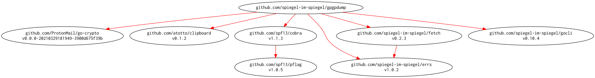

# [gpgpdump] - OpenPGP packet visualizer

[](https://github.com/spiegel-im-spiegel/gpgpdump/actions)
[](https://github.com/spiegel-im-spiegel/gpgpdump/actions)
[](https://raw.githubusercontent.com/spiegel-im-spiegel/gpgpdump/master/LICENSE)
[](https://github.com/spiegel-im-spiegel/gpgpdump/releases/latest)

[gpgpdump] is a OpenPGP ([RFC 4880]) packet visualizer by [golang](https://golang.org/).

- Command-line interface, based on [pgpdump](https://github.com/kazu-yamamoto/pgpdump) design by [kazu-yamamoto](https://github.com/kazu-yamamoto).
- Output with plain text or [JSON](https://tools.ietf.org/html/rfc7159)-formatted text
- Support [RFC 5581] and [RFC 6637]
- Support a part of [RFC 4880bis]

This package is required Go 1.16 or later.

## Download and Build

```
$ go install github.com/spiegel-im-spiegel/gpgpdump@latest
```

## Binaries

See [latest release](https://github.com/spiegel-im-spiegel/gpgpdump/releases/latest).

## Usage

```
$ gpgpdump -h
OpenPGP (RFC 4880) packet visualizer by golang.

Usage:
  gpgpdump [flags]
  gpgpdump [command]

Available Commands:
  completion  Generate completion script
  fetch       Dumps OpenPGP packets form the Web
  github      Dumps OpenPGP keys registered on GitHub
  help        Help about any command
  hkp         Dumps OpenPGP packets from the key server
  version     Print the version number

Flags:
  -a, --armor         accepts ASCII armor text only
  -c, --cert          dumps attested certification in signature packets (tag 2)
      --clipboard     input from clipboard (ASCII armor text only)
      --debug         for debug
  -f, --file string   path of OpenPGP file
  -h, --help          help for gpgpdump
      --indent int    indent size for output text
  -i, --int           dumps multi-precision integers
  -j, --json          output with JSON format
  -l, --literal       dumps literal packets (tag 11)
  -m, --marker        dumps marker packets (tag 10)
  -p, --private       dumps private packets (tag 60-63)
  -u, --utc           output with UTC time
  -v, --version       output version of gpgpdump

Use "gpgpdump [command] --help" for more information about a command.
```

### Output with plain text

```
$ cat testdata/eccsig.asc | gpgpdump -u --indent 2
Signature Packet (tag 2) (94 bytes)
  Version: 4 (current)
  Signiture Type: Signature of a canonical text document (0x01)
  Public-key Algorithm: ECDSA public key algorithm (pub 19)
  Hash Algorithm: SHA2-256 (hash 8)
  Hashed Subpacket (6 bytes)
    Signature Creation Time (sub 2): 2015-01-24T02:52:15Z
  Unhashed Subpacket (10 bytes)
    Issuer (sub 16): 0x31fbfda95fbbfa18
  Hash left 2 bytes
    36 1f
  ECDSA value r (256 bits)
  ECDSA value s (252 bits)
```

### Output with JSON-formatted text

```
$ cat testdata/eccsig.asc | gpgpdump -j -u | jq .
{
  "Packet": [
    {
      "name": "Signature Packet (tag 2)",
      "note": "94 bytes",
      "Item": [
        {
          "name": "Version",
          "value": "4",
          "note": "current"
        },
        {
          "name": "Signiture Type",
          "value": "Signature of a canonical text document (0x01)"
        },
        {
          "name": "Public-key Algorithm",
          "value": "ECDSA public key algorithm (pub 19)"
        },
        {
          "name": "Hash Algorithm",
          "value": "SHA2-256 (hash 8)"
        },
        {
          "name": "Hashed Subpacket",
          "note": "6 bytes",
          "Item": [
            {
              "name": "Signature Creation Time (sub 2)",
              "value": "2015-01-24T02:52:15Z"
            }
          ]
        },
        {
          "name": "Unhashed Subpacket",
          "note": "10 bytes",
          "Item": [
            {
              "name": "Issuer (sub 16)",
              "value": "0x31fbfda95fbbfa18"
            }
          ]
        },
        {
          "name": "Hash left 2 bytes",
          "dump": "36 1f"
        },
        {
          "name": "ECDSA value r",
          "note": "256 bits"
        },
        {
          "name": "ECDSA value s",
          "note": "252 bits"
        }
      ]
    }
  ]
}
```

### HKP Access Mode

```
$ gpgpdump hkp -h
Dumps OpenPGP packets from the key server.

Usage:
  gpgpdump hkp [flags] {userID | keyID}

Aliases:
  hkp, h

Flags:
  -h, --help               help for hkp
      --keyserver string   OpenPGP key server (default "keys.gnupg.net")
      --port int           port number of OpenPGP key server (default 11371)
      --raw                output raw text from OpenPGP key server
      --secure             enable HKP over HTTPS

Global Flags:
  -a, --armor        accepts ASCII armor text only
  -c, --cert         dumps attested certification in signature packets (tag 2)
      --debug        for debug
      --indent int   indent size for output text
  -i, --int          dumps multi-precision integers
  -j, --json         output with JSON format
  -l, --literal      dumps literal packets (tag 11)
  -m, --marker       dumps marker packets (tag 10)
  -p, --private      dumps private packets (tag 60-63)
  -u, --utc          output with UTC time

$ gpgpdump hkp -u --indent 2 0x44ce6900e2b307a4
Public-Key Packet (tag 6) (269 bytes)
  Version: 4 (current)
  Public key creation time: 2009-11-08T15:20:55Z
  Public-key Algorithm: RSA (Encrypt or Sign) (pub 1)
  RSA public modulus n (2048 bits)
  RSA public encryption exponent e (17 bits)
...
```

### GitHub Access Mode

```
$ gpgpdump github -h
Dumps OpenPGP keys registered on GitHub.

Usage:
  gpgpdump github [flags] GitHubUserID

Aliases:
  github, gh, g

Flags:
  -h, --help           help for github
      --keyid string   OpenPGP key ID
      --raw            output raw text (ASCII armor text)

Global Flags:
  -a, --armor        accepts ASCII armor text only
  -c, --cert         dumps attested certification in signature packets (tag 2)
      --debug        for debug
      --indent int   indent size for output text
  -i, --int          dumps multi-precision integers
  -j, --json         output with JSON format
  -l, --literal      dumps literal packets (tag 11)
  -m, --marker       dumps marker packets (tag 10)
  -p, --private      dumps private packets (tag 60-63)
  -u, --utc          output with UTC time

$ gpgpdump github spiegel-im-spiegel --keyid 0x3b460ba9a59048c9 -u --indent 2
Public-Key Packet (tag 6) (51 bytes)
  Version: 4 (current)
  Public key creation time: 2020-10-27T06:20:19Z
  Public-key Algorithm: EdDSA (pub 22)
  ECC Curve OID: ed25519 (256bits key size)
    2b 06 01 04 01 da 47 0f 01
  EdDSA EC point (Native point format of the curve follows) (263 bits)
...
```

### Fetch from the Web

```
$ gpgpdump fetch -h
Dumps OpenPGP packets form the Web.

Usage:
  gpgpdump fetch [flags] URL

Aliases:
  fetch, fch, f

Flags:
  -h, --help   help for fetch
      --raw    output raw data

Global Flags:
  -a, --armor        accepts ASCII armor text only
  -c, --cert         dumps attested certification in signature packets (tag 2)
      --debug        for debug
      --indent int   indent size for output text
  -i, --int          dumps multi-precision integers
  -j, --json         output with JSON format
  -l, --literal      dumps literal packets (tag 11)
  -m, --marker       dumps marker packets (tag 10)
  -p, --private      dumps private packets (tag 60-63)
  -u, --utc          output with UTC time

$ gpgpdump fetch https://github.com/spiegel-im-spiegel.gpg -u --indent 2
Public-Key Packet (tag 6) (1198 bytes)
  Version: 4 (current)
  Public key creation time: 2013-04-28T10:29:43Z
  Public-key Algorithm: DSA (Digital Signature Algorithm) (pub 17)
  DSA p (3072 bits)
  DSA q (q is a prime divisor of p-1) (256 bits)
  DSA g (3070 bits)
  DSA y (= g^x mod p where x is secret) (3067 bits)
...
```

### Generate Shell Script for Command Completion

Help for “gpgpdump completion -h”

#### Bash

```
$ source <(gpgpdump completion bash)
```

or

```
$ gpgpdump completion bash > /etc/bash_completion.d/gpgpdump
```

#### Zsh

```
$ gpgpdump completion zsh > "${fpath[1]}/_gpgpdump"
```

#### Fish

```
$ gpgpdump completion fish > ~/.config/fish/completions/gpgpdump.fish
```

#### PowerShell

```
PS> gpgpdump completion powershell | Out-String | Invoke-Expression
```

## Modules Requirement Graph

[](./dependency.png)

[gpgpdump]: https://github.com/spiegel-im-spiegel/gpgpdump "spiegel-im-spiegel/gpgpdump: gpgpdump - OpenPGP packet visualizer"
[RFC 4880]: https://tools.ietf.org/html/rfc4880
[RFC 4880bis]: https://datatracker.ietf.org/doc/draft-ietf-openpgp-rfc4880bis/
[RFC 5581]: http://tools.ietf.org/html/rfc5581
[RFC 6637]: http://tools.ietf.org/html/rfc6637
[dep]: https://github.com/golang/dep "golang/dep: Go dependency management tool"
