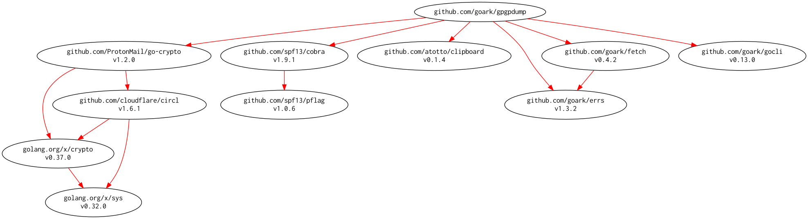

# [gpgpdump] - OpenPGP packet visualizer

[](https://travis-ci.org/spiegel-im-spiegel/gpgpdump)
[](https://raw.githubusercontent.com/spiegel-im-spiegel/gpgpdump/master/LICENSE)
[](https://github.com/spiegel-im-spiegel/gpgpdump/releases/latest)

[gpgpdump] is a OpenPGP ([RFC 4880]) packet visualizer by [golang](https://golang.org/).

- Based on [pgpdump](https://github.com/kazu-yamamoto/pgpdump)
- Provide [golang](https://golang.org/) package and command-line Interface
- Output with [TOML](https://github.com/toml-lang/toml) (or [JSON](https://tools.ietf.org/html/rfc7159)) format
- Support [RFC 5581] and [RFC 6637]

## Install

```
$ go get -v github.com/spiegel-im-spiegel/gpgpdump
```

Installing by [dep].

```
$ dep ensure -add github.com/spiegel-im-spiegel/godump
```

### Usage

```go
const openpgpStr = `
-----BEGIN PGP SIGNATURE-----
Version: GnuPG v2

iF4EARMIAAYFAlTDCN8ACgkQMfv9qV+7+hg2HwEA6h2iFFuCBv3VrsSf2BREQaT1
T1ZprZqwRPOjiLJg9AwA/ArTwCPz7c2vmxlv7sRlRLUI6CdsOqhuO1KfYXrq7idI
=ZOTN
-----END PGP SIGNATURE-----
`

info, err := gpgpdump.Parse(strings.NewReader(openpgpStr), options.New())
if err != nil {
	return
}
fmt.Println(info.Packets[0].Name)
// Output:
// Signature Packet (tag 2)
```

## Command-Line Interface

### Binaries

See [latest release](https://github.com/spiegel-im-spiegel/gpgpdump/releases/latest).

### Usage

```
$ gpgpdump -h
Usage:
  gpgpdump [flags] [PGPfile]

Flags:
  -a, --armor     accepts ASCII input only
  -h, --help      help for gpgpdump
  -i, --int       dumps multi-precision integers
  -j, --json      output with JSON format
  -l, --literal   dumps literal packets (tag 11)
  -m, --marker    dumps marker packets (tag 10)
  -p, --private   dumps private packets (tag 60-63)
  -t, --toml      output with TOML format
  -u, --utc       output with UTC time
  -v, --version   output version of gpgpdump

$ cat sig
-----BEGIN PGP SIGNATURE-----
Version: GnuPG v2

iF4EARMIAAYFAlTDCN8ACgkQMfv9qV+7+hg2HwEA6h2iFFuCBv3VrsSf2BREQaT1
T1ZprZqwRPOjiLJg9AwA/ArTwCPz7c2vmxlv7sRlRLUI6CdsOqhuO1KfYXrq7idI
=ZOTN
-----END PGP SIGNATURE-----

$ cat sig | gpgpdump -u
Signature Packet (tag 2) (94 bytes)
    Version: 4 (new)
    Signiture Type: Signature of a canonical text document (0x01)
    Public-key Algorithm: ECDSA public key algorithm (pub 19)
    Hash Algorithm: SHA256 (hash 8)
    Hashed Subpacket (6 bytes)
        Signature Creation Time (sub 2): 2015-01-24T02:52:15Z
    Unhashed Subpacket (10 bytes)
        Issuer (sub 16): 0x31fbfda95fbbfa18
    Hash left 2 bytes
        36 1f
    ECDSA r (256 bits)
    ECDSA s (252 bits)

$ cat sig | gpgpdump -t -u
[[Packet]]
  name = "Signature Packet (tag 2)"
  note = "94 bytes"

  [[Packet.Item]]
    name = "Version"
    value = "4"
    note = "new"

  [[Packet.Item]]
    name = "Signiture Type"
    value = "Signature of a canonical text document (0x01)"

  [[Packet.Item]]
    name = "Public-key Algorithm"
    value = "ECDSA public key algorithm (pub 19)"

  [[Packet.Item]]
    name = "Hash Algorithm"
    value = "SHA256 (hash 8)"

  [[Packet.Item]]
    name = "Hashed Subpacket"
    note = "6 bytes"

    [[Packet.Item.Item]]
      name = "Signature Creation Time (sub 2)"
      value = "2015-01-24T02:52:15Z"

  [[Packet.Item]]
    name = "Unhashed Subpacket"
    note = "10 bytes"

    [[Packet.Item.Item]]
      name = "Issuer (sub 16)"
      value = "0x31fbfda95fbbfa18"

  [[Packet.Item]]
    name = "Hash left 2 bytes"
    dump = "36 1f"

  [[Packet.Item]]
    name = "ECDSA r"
    note = "256 bits"

  [[Packet.Item]]
    name = "ECDSA s"
    note = "252 bits"

$ cat sig | gpgpdump -j -u
{
  "Packet": [
    {
      "name": "Signature Packet (tag 2)",
      "note": "94 bytes",
      "Item": [
        {
          "name": "Version",
          "value": "4",
          "note": "new"
        },
        {
          "name": "Signiture Type",
          "value": "Signature of a canonical text document (0x01)"
        },
        {
          "name": "Public-key Algorithm",
          "value": "ECDSA public key algorithm (pub 19)"
        },
        {
          "name": "Hash Algorithm",
          "value": "SHA256 (hash 8)"
        },
        {
          "name": "Hashed Subpacket",
          "note": "6 bytes",
          "Item": [
            {
              "name": "Signature Creation Time (sub 2)",
              "value": "2015-01-24T02:52:15Z"
            }
          ]
        },
        {
          "name": "Unhashed Subpacket",
          "note": "10 bytes",
          "Item": [
            {
              "name": "Issuer (sub 16)",
              "value": "0x31fbfda95fbbfa18"
            }
          ]
        },
        {
          "name": "Hash left 2 bytes",
          "dump": "36 1f"
        },
        {
          "name": "ECDSA r",
          "note": "256 bits"
        },
        {
          "name": "ECDSA s",
          "note": "252 bits"
        }
      ]
    }
  ]
}
```

## Dependencies

```
dep status -dot | dot -Tpng -o dependency.png
```

[](dependency.png)

[gpgpdump]: https://github.com/spiegel-im-spiegel/gpgpdump "spiegel-im-spiegel/gpgpdump: gpgpdump - OpenPGP packet visualizer"
[RFC 4880]: https://tools.ietf.org/html/rfc4880
[RFC 5581]: http://tools.ietf.org/html/rfc5581
[RFC 6637]: http://tools.ietf.org/html/rfc6637
[dep]: https://github.com/golang/dep "golang/dep: Go dependency management tool"
